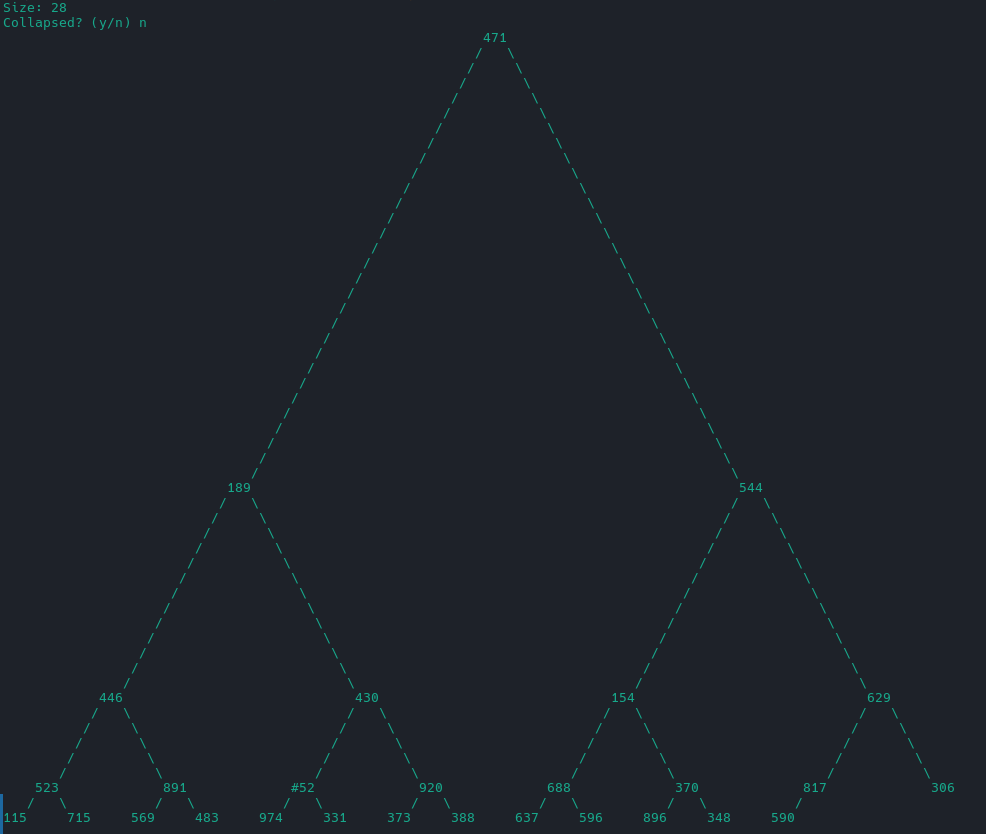

# ASCII Tree

## Requirements

- python3

## Usage

```bash
python3 create-tree.py
```


It asks you the tree size and if you want to collapse the tree. 
It generates a random array with that size.
It shows you the ascii drawing.

## Function
If you have the array you can use `show_tree` and pass (in order):
  - array
  - 0
  - height
  - digits of your numbers (you can use get_max_digits_of(A))
  - character (for spacing, default "#")
  - character_transform (for fill number with less digits, default="#")
  - collapsed (if you want a tree collapsed or not, default=False)

## Examples
Collapsed Random Tree 


Not Collapsed Random Tree


